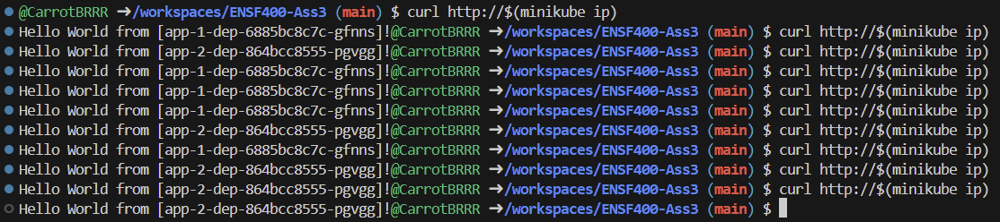

# ENSF400-Ass3
## Commands to run:
### minikube start
```
minikube start
minikube addons enable ingress
```

### nginx
```
kubectl apply -f nginx-configmap.yaml
kubectl apply -f nginx-dep.yaml
kubectl apply -f nginx-svc.yaml
kubectl apply -f nginx-ingress.yaml
```

### app 1
```
kubectl apply -f app-1-dep.yaml
kubectl apply -f app-1-svc.yaml
kubectl apply -f app-1-ingress.yaml
```

### app 2
```
kubectl apply -f app-2-dep.yaml
kubectl apply -f app-2-svc.yaml
kubectl apply -f app-2-ingress.yaml
```

## How Output Requirements are met
<figure>
<figcaption>Output for the nginx service</figcaption>

</figure>

<figure>
<figcaption>Output for canary deployment</figcaption>

</figure>


| Requirement | How met |
| - | - |
| Nginx-dep deployed with 5 replicas with<br/>version tag 1.14.2 and exposes port 80 | nginx-dep.yaml |
| Config map with nginx cfg details<br/>mounted on nginx-dep | nginx-configmap.yaml<br/>config map mounted to nginx config in nginx-dep.yaml|
| Nginx Service selecting pods<br/>from nginx deployment| nginx-svc.yaml<br/>Pods from nginx deployment selected<br/>Service is exposed on port 80 |
| nginx ingress | nginx-ingress.yaml redirects '/' to 'nginx-svc' service |
| Write deployment and svc files<br/>for App-1 and App-2 | app-1-dep.yaml<br/>app-1-svc.yaml<br/>app-2-dep.yaml<br/>app-2-svc.yaml |
| Ingress file to set up Canary deployment | Canary Deployment<br/>app-1-ingress.yaml<br/>app-2-ingress.yaml<br/> 70% of requests to '/app' to app-1<br/> remaining 30% of requests to '/app' to app-2 |